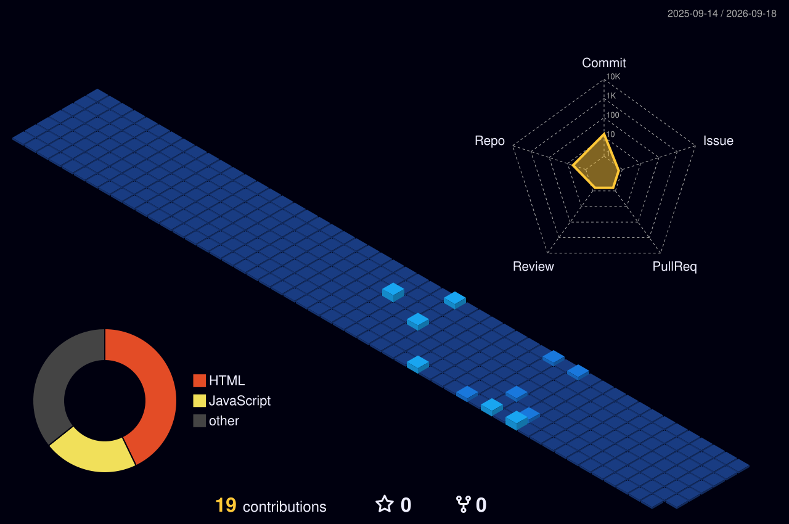

<h1 align="center">Hi 👋, I'm Prabhuji Mishra</h1>

<h3 align="center">
AI Agent & Automation Engineer | Building Smart Workflows | B.Tech CSE @ SRMIST
</h3>

<p align="center">
  <a href="https://github.com/javcod">
    
  </a>
</p>

---

## 🚀 About Me

I am a B.Tech Computer Science student focused on building real-world AI automation systems, AI agents, and productivity tools.

Currently, I am working on **MailPilot AI – AI-Powered Gmail Copilot**, an intelligent Gmail assistant that analyzes emails, generates contextual replies, creates Gmail drafts, and helps users manage email workflows more efficiently.

---

## 🧠 Current Focus

- Building AI agents and automation workflows  
- Learning production-ready AI deployment  
- Exploring LangChain, RAG, vector databases, and multi-agent systems  
- Improving full-stack project quality with React, Node.js, MongoDB, and APIs  

---

## 🛠️ Tech Stack

<p align="left">
  
</p>

---

## 🔥 Featured Project

### MailPilot AI – AI-Powered Gmail Copilot

An AI-powered Gmail assistant that helps users analyze emails, generate contextual replies, create Gmail drafts, and manage email workflows through a modern dashboard.

**Tech Stack:** React, Node.js, Express.js, MongoDB, Gmail API, OAuth, REST APIs, AI Models

🔗 Repository: [MailPilot AI](https://github.com/javcod/mailpilot-ai)

---

## 📌 Projects

| Project | Description | Tech |
|---|---|---|
| **MailPilot AI** | AI-powered Gmail Copilot for email analysis, reply generation, and Gmail draft creation | React, Node.js, MongoDB, Gmail API |
| **CyberCare** | Cyber complaint management system with AI-based complaint prioritization | Flask, Python, scikit-learn |
| **AI Automation Workflows** | Experiments with AI agents, APIs, and workflow automation | AI Tools, APIs, Automation |

---

## 📊 GitHub Stats

<p align="center">
  
  
</p>

---

## 🧩 3D Contribution Graph



---

## 🌱 Learning Journey

```txt
AI Agents → Automation Workflows → Real-World Projects → Internship Ready
